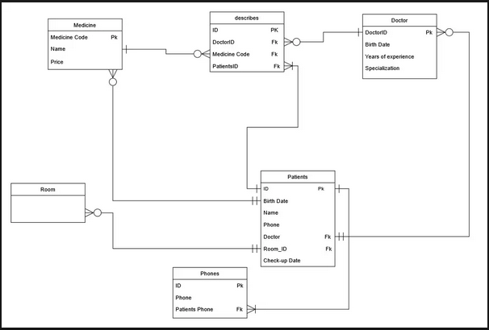

# Hospital Management System - Database Design 🏥

A comprehensive database design project for managing hospital operations. This project covers the entire lifecycle from logical requirements (ERD) to physical implementation (Schema).

---

## 📋 System Requirements

### 1. Doctors & Patients
* Each **Patient** is examined by exactly one **Doctor**.
* A **Doctor** can examine multiple **Patients** ($1:N$ Relationship).
* The **Check-up Date** is recorded for every patient record to track the last visit.

### 2. Patients & Rooms
* A **Patient** is assigned to stay in only one **Room**.
* Each **Room** can accommodate multiple **Patients** (shared rooms) ($1:N$ Relationship).

### 3. Prescriptions (Doctors, Patients & Medicines)
* A **Doctor** can prescribe multiple **Medicines**.
* The system tracks which doctor prescribed which medicine to which patient through the `describes` table.

---

## 🖼️ 1. Entity-Relationship Diagram (ERD)
The logical model focusing on entities, attributes, and business rules.

---

## 🛠️ 2. Physical Database Schema
The transition from logical design to physical tables, including Primary Keys (PK) and Foreign Keys (FK).

### 🔑 Key Implementation Details:
* **`describes` Table:** A bridge table that handles the many-to-many relationship. It was enhanced by adding `PatientsID` to link prescriptions directly to patients.
* **`Phones` Table:** Created to handle the "Multivalued Attribute" for patient phone numbers, ensuring 1st Normal Form (1NF).
* **Data Integrity:** `Check-up Date` was moved to the `Patients` table to accurately reflect the date of each patient's examination.

---

## 📂 Files in this Repository
* **MyERD_Hospital.drawio**: [Link to Google Drive]([https://drive.google.com/file/d/1UJxjpMETy7REYi_QFSMYw2oDcpIKk5LW/view?usp=sharing]).
* **Hospital_System.drawio**: [Link to Google Drive]([https://drive.google.com/file/d/1_vu_gGR3eOM9gEwpiiGE-1d0uSSVu2ls/view]) 🔗
* **MyERD_Hospital.png**: The exported ERD image.
* **Hospital_Schema.png**: The exported Physical Schema image.
* **README.md**: Project documentation.

---

## 🚀 Tools Used
* **Draw.io** - For designing the ER & Schema diagrams.
* **GitHub** - For version control and portfolio hosting.

---
**Developed by: zuhair Shell** ✍️
